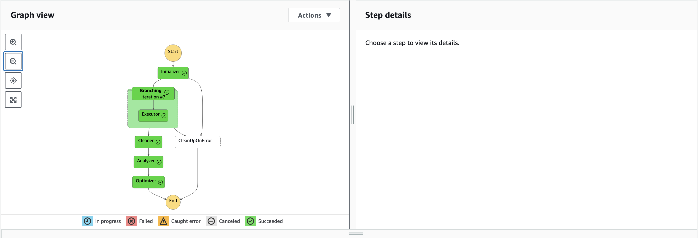
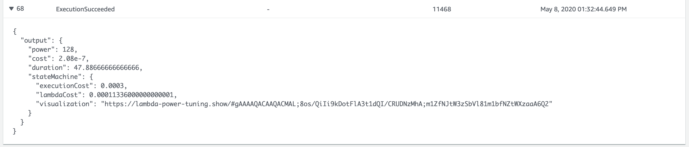

# The Lambda Power Tuner

This is an AWS CDK project that deploys the awesome [AWS Lambda Power Tuning](https://github.com/alexcasalboni/aws-lambda-power-tuning) project. 

AWS Lambda Power Tuning is an AWS Step Functions state machine that helps you optimize your Lambda functions in a data-driven way.

The state machine is designed to be quick and language agnostic. You can provide any Lambda function as input and the state machine will run it with multiple power configurations (from 128MB to 3GB), analyze execution logs and suggest you the best configuration to minimize cost or maximize performance.

The input function will be executed in your AWS account - performing real HTTP calls, SDK calls, cold starts, etc. The state machine also supports cross-region invocations and you can enable parallel execution to generate results in just a few seconds. Optionally, you can configure the state machine to automatically optimize the function and the end of its execution.


The reason for doing this is that it helps with two of the Serverless Well Architected pillars:

- Performance Efficiency Pillar
- Cost Optimization Pillar


The [AWS Well-Architected](https://aws.amazon.com/architecture/well-architected/) Framework helps you understand the pros and cons of
decisions you make while building systems on AWS. By using the Framework, you will learn architectural best practices for designing and operating reliable, secure, efficient, and cost-effective systems in the cloud. It provides a way for you to consistently measure your architectures against best practices and identify areas for improvement.

We believe that having well-architected systems greatly increases the likelihood of business success.

[Serverless Lens Whitepaper](https://d1.awsstatic.com/whitepapers/architecture/AWS-Serverless-Applications-Lens.pdf) <br />
[Well Architected Whitepaper](http://d0.awsstatic.com/whitepapers/architecture/AWS_Well-Architected_Framework.pdf)

## Performance Efficiency Pillar
The performance efficiency pillar focuses on the efficient use of computing resources to meet requirements and the maintenance of that efficiency as demand changes and technologies evolve.

Performance efficiency in the cloud is composed of four areas:
- Selection
- Review
- Monitoring
- Tradeoffs

Take a data-driven approach to selecting a high-performance architecture. Gather data on all aspects of the architecture, from the high-level design to the selection and configuration of resource types. By reviewing your choices on a cyclical basis, you will ensure that you are taking advantage of the continually evolving AWS Cloud.

Monitoring will ensure that you are aware of any deviance from expected performance and can take action on it. Finally, you can make tradeoffs in your architecture to improve performance, such as using compression or caching, or by relaxing consistency requirements.

>PER 1: How have you optimized the performance of your serverless application?

### Selection
Run performance tests on your serverless application using steady and burst rates. Using the result, try tuning capacity units and load test after changes to help you select the best configuration:
- Lambda: Test different memory settings as CPU, network, and storage IOPS are allocated proportionally. 

## Cost Optimization Pillar
The cost optimization pillar includes the continual process of refinement and improvement of a system over its entire lifecycle. From the initial design of your first proof of concept to the ongoing operation of production workloads, adopting the practices in this document will enable you to build and operate cost-aware systems that achieve business outcomes and minimize costs, thus allowing your business to maximize its return on investment.

There are four best practice areas for cost optimization in the cloud:
- Cost-effective resources
- Matching supply and demand
- Expenditure awareness
- Optimizing over time

> COST 1: How do you optimize your costs?

### Cost-Effective Resources
Serverless architectures are easier to manage in terms of correct resource allocation. Due to its pay-per-value pricing model and scale based on demand, serverless effectively reduces the capacity planning effort.

As covered in the operational excellence and performance pillars, optimizing your serverless application has a direct impact on the value it produces and its cost.

As Lambda proportionally allocates CPU, network, and storage IOPS based on
memory, the faster the execution the cheaper and more value your function produces due to 100-ms billing incremental dimension.

## Default Configuration Settings Provided

There are some variables that you can pass into the SAR app to manipulate the power tuning step function. You can find two that I have set for you at the top of the cdk stack

```typescript
let powerValues = '128,256,512,1024,1536,3008';
let lambdaResource = "*";
```

the powerValues lets you pick exactly what AWS Lambda memory settings you want to tune against. The full list of allowed values is:
```
['128','192','256','320','384','448','512','576','640','704','768','832','896','960','1024','1088','1152','1216','1280','1344','1408','1472','1536','3008']
```

lambdaResource is about what IAM permissions do you want to give the state machine? In general, you want to give your components the least privileges they require to reduce their blast radius. 

By default the power tuner uses * permissions which means that it has wide scope and can tune any function. If you can scope this down to something more specific that is advisable.

Alex gave me this advice

I can see 3 common patterns :
1) use * (easy default, not always ideal)
2) restrict to region or name prefix (better)
3) restrict to only 1 ARN (not very flexible but ideal for CI/CD scenarios where you’ll delete the stack immediately after tuning)

An example of option 3 is included in the stack but currently commented out, so all you have to do is uncomment it.

```ts
// Uncomment to only allow this power tuner to manipulate this defined function
//lambdaResource = exampleLambda.functionArn;
```


## How To Test This Pattern

After deployment, navigate to the step functions section of the AWS Console.

from the list of availabe state machines, pick the power tuner state machine.

Now click "start execution" in the top right

In the input field enter the following JSON and add in the ARN to the lambda you want to test. 
>You can either use the example lambda we bundled by getting the ARN from the cdk deploy logs or any another function in your account if you know the ARN.
```
{
  "lambdaARN": "your lambda arn to test",
  "powerValues": [
    128,
    256,
    512,
    1024,
    2048,
    3008
  ],
  "num": 10,
  "payload": {},
  "parallelInvocation": true,
  "strategy": "cost"
}
```

Click "Start Execution" in the bottom right.

When the tuner has finished your visual workflow should look like:



Then you can scroll down to the very last event and expand it to get the URL for your results graph:



## Power Tuner UI

If you want to deploy a UI to powertune your Lambda Functions rather than using the AWS Console checkout [this project](https://github.com/mattymoomoo/aws-power-tuner-ui)

## Useful commands

 * `npm run build`   compile typescript to js
 * `npm run watch`   watch for changes and compile
 * `npm run test`    perform the jest unit tests
 * `npm run deploy`      deploy this stack to your default AWS account/region
 * `cdk diff`        compare deployed stack with current state
 * `cdk synth`       emits the synthesized CloudFormation template
